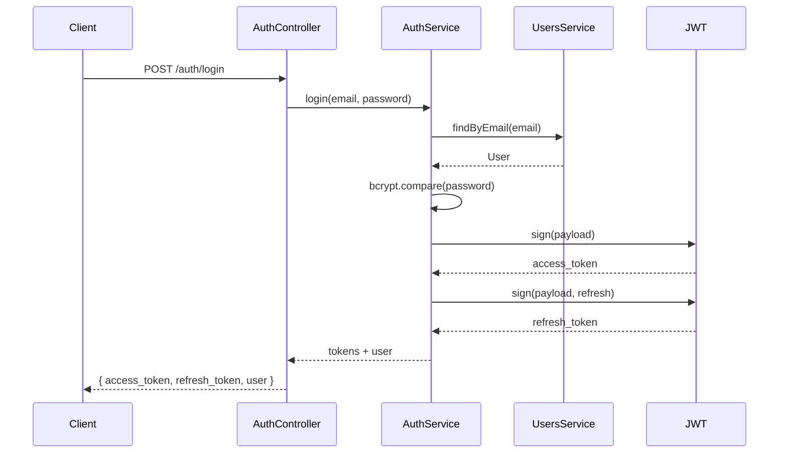

# Módulo de Autenticación - Auth

## 📁 Estructura

```
src/modules/auth/
├── dto/
│   ├── login.dto.ts
│   └── register.dto.ts
├── strategies/
│   └── jwt.strategy.ts
├── auth.controller.ts
├── auth.service.ts
└── auth.module.ts
```

## 🔐 Endpoints

### 1. Login
```
POST /api/auth/login
```

**Request**:
```json
{
  "email": "admin@papeleria.com",
  "password": "password123"
}
```

**Response**:
```json
{
  "success": true,
  "data": {
    "access_token": "eyJhbGciOiJIUzI1NiIsInR5cCI6IkpXVCJ9...",
    "refresh_token": "eyJhbGciOiJIUzI1NiIsInR5cCI6IkpXVCJ9...",
    "user": {
      "id": "uuid",
      "firstName": "Admin",
      "lastName": "User",
      "email": "admin@papeleria.com",
      "role": "admin"
    }
  },
  "message": "Login successful"
}
```

### 2. Register
```
POST /api/auth/register
```

**Request**:
```json
{
  "firstName": "Juan",
  "lastName": "Pérez",
  "email": "juan@papeleria.com",
  "password": "password123",
  "role": "employee"
}
```

### 3. Refresh Token
```
POST /api/auth/refresh
```

**Request**:
```json
{
  "refresh_token": "eyJhbGciOiJIUzI1NiIsInR5cCI6IkpXVCJ9..."
}
```

**Response**:
```json
{
  "success": true,
  "data": {
    "access_token": "eyJhbGciOiJIUzI1NiIsInR5cCI6IkpXVCJ9..."
  }
}
```

### 4. Get Profile
```
GET /api/auth/profile
Authorization: Bearer <access_token>
```

**Response**:
```json
{
  "success": true,
  "data": {
    "id": "uuid",
    "firstName": "Juan",
    "lastName": "Pérez",
    "email": "juan@papeleria.com",
    "role": "employee",
    "isActive": true
  }
}
```

### 5. Logout
```
POST /api/auth/logout
Authorization: Bearer <access_token>
```

## 🔑 JWT Strategy

El sistema usa **Passport JWT** con dos tipos de tokens:

1. **Access Token**: Expira en 1 día (configurable)
2. **Refresh Token**: Expira en 7 días (configurable)

**Payload del JWT**:
```json
{
  "sub": "user-id",
  "email": "user@example.com",
  "role": "employee"
}
```

## 🛡️ Seguridad

- ✅ Passwords hasheados con bcrypt (10 rounds)
- ✅ Validación de usuario activo
- ✅ Tokens firmados con secret
- ✅ Refresh token con secret diferente
- ✅ Guards para proteger rutas

## 🔄 Flujo de Autenticación



## 📝 Uso en Postman

1. **Login** para obtener tokens
2. Copiar `access_token`
3. En otras peticiones, agregar header:
   ```
   Authorization: Bearer <access_token>
   ```

## ⚙️ Configuración

Variables en `.env`:
```env
JWT_SECRET=your-secret-key-change-in-production
JWT_EXPIRES_IN=1d
JWT_REFRESH_SECRET=your-refresh-secret-change-in-production
JWT_REFRESH_EXPIRES_IN=7d
```
