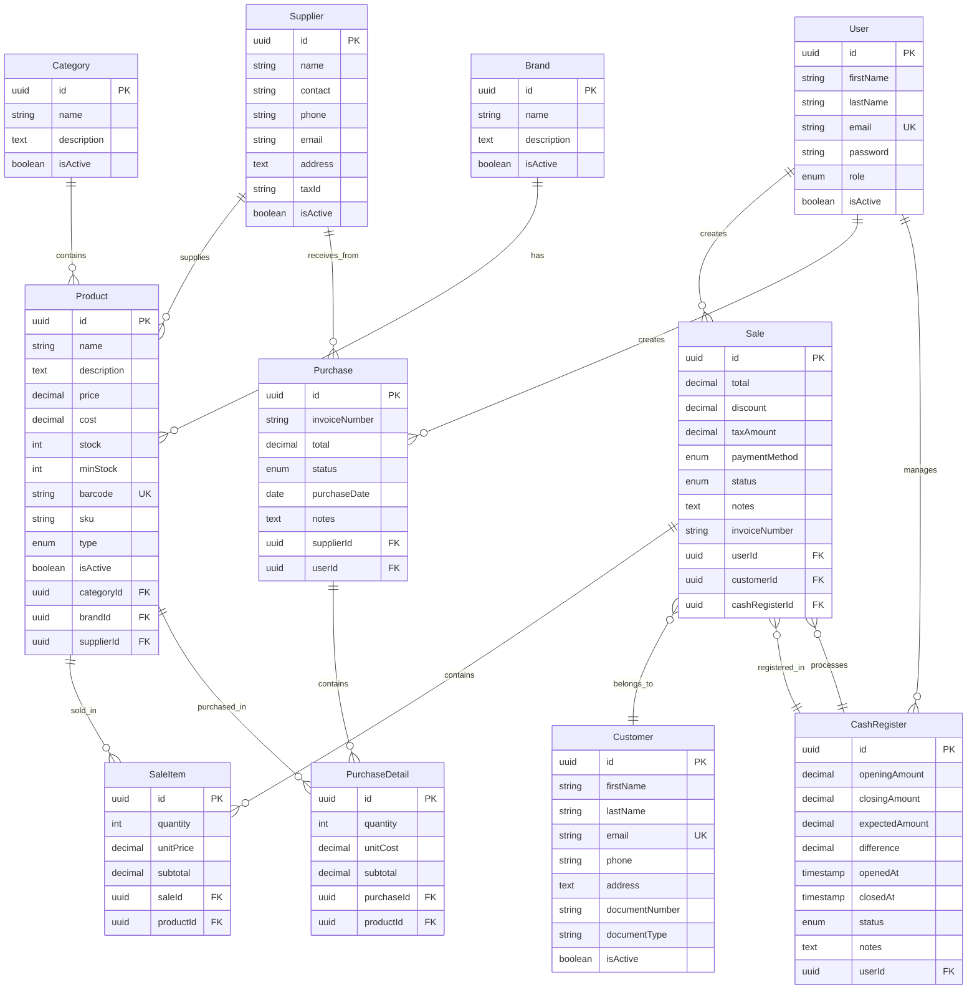

# Database Schema - Papelería

## Diagrama de Relaciones



## Entidades y Relaciones

### 1. **User** (Usuario)
Empleados del sistema con diferentes roles.

**Relaciones**:
- `hasMany(Sale)` - Ventas realizadas
- `hasMany(Purchase)` - Compras registradas
- `hasMany(CashRegister)` - Turnos de caja

**Roles**:
- `admin` - Administrador total
- `employee` - Empleado general
- `cashier` - Cajero

---

### 2. **Category** (Categoría)
Clasificación de productos (Cuadernos, Escritura, Arte, etc.)

**Relaciones**:
- `hasMany(Product)` - Productos de la categoría

**Ejemplos**:
- Cuadernos
- Útiles de Escritura
- Arte y Manualidades
- Papelería Corporativa

---

### 3. **Brand** (Marca)
Marcas de productos (Norma, Bic, Faber-Castell, etc.)

**Relaciones**:
- `hasMany(Product)` - Productos de la marca

**Ejemplos**:
- Norma
- Bic
- Faber-Castell
- Pelikan

---

### 4. **Supplier** (Proveedor)
Proveedores que surten los productos.

**Relaciones**:
- `hasMany(Product)` - Productos que suministra
- `hasMany(Purchase)` - Compras realizadas al proveedor

**Campos Clave**:
- `taxId` - NIT del proveedor
- `contact` - Persona de contacto

---

### 5. **Customer** (Cliente)
Clientes que compran en la papelería.

**Relaciones**:
- `hasMany(Sale)` - Compras realizadas

**Campos Clave**:
- `documentNumber` - Número de documento
- `documentType` - CC, NIT, CE, PA

**Nota**: Cliente es opcional en ventas (ventas al público general)

---

### 6. **Product** (Producto)
Productos del catálogo.

**Relaciones**:
- `belongsTo(Category)` - Categoría del producto
- `belongsTo(Brand)` - Marca del producto
- `belongsTo(Supplier)` - Proveedor principal
- `hasMany(SaleItem)` - Detalles de ventas
- `hasMany(PurchaseDetail)` - Detalles de compras

**Campos Vitales**:
- `barcode` - Código de barras (ÚNICO)
- `minStock` - Stock mínimo para alertas
- `type` - `physical` o `service`

**Tipos de Producto**:
- **PHYSICAL**: Productos físicos con stock (cuadernos, lápices)
- **SERVICE**: Servicios que no descuentan stock (fotocopias, impresiones)

---

### 7. **Sale** (Venta)
Cabecera de la factura/venta.

**Relaciones**:
- `belongsTo(User)` - Usuario que realizó la venta
- `belongsTo(Customer)` - Cliente (opcional)
- `belongsTo(CashRegister)` - Caja donde se registró
- `hasMany(SaleItem)` - Detalles de la venta

**Campos Clave**:
- `invoiceNumber` - Número de factura
- `paymentMethod` - cash, card, transfer, nequi, daviplata
- `taxAmount` - Impuestos (IVA)

---

### 8. **SaleItem** (Detalle de Venta)
Líneas de la venta (ej: 2 lápices, 1 borrador).

**Relaciones**:
- `belongsTo(Sale)` - Venta a la que pertenece
- `belongsTo(Product)` - Producto vendido

---

### 9. **Purchase** (Compra)
Entrada de stock desde proveedores.

**Relaciones**:
- `belongsTo(Supplier)` - Proveedor
- `belongsTo(User)` - Usuario que registró
- `hasMany(PurchaseDetail)` - Detalles de la compra

**Estados**:
- `pending` - Pendiente de recibir
- `received` - Recibida
- `cancelled` - Cancelada

---

### 10. **PurchaseDetail** (Detalle de Compra)
Líneas de la compra.

**Relaciones**:
- `belongsTo(Purchase)` - Compra a la que pertenece
- `belongsTo(Product)` - Producto comprado

**Nota**: Al recibir una compra, se actualiza el stock del producto.

---

### 11. **CashRegister** (Caja Registradora)
Control de turnos y arqueo de caja.

**Relaciones**:
- `belongsTo(User)` - Usuario responsable del turno
- `hasMany(Sale)` - Ventas del turno

**Campos Importantes**:
- `openingAmount` - Monto inicial
- `closingAmount` - Monto final (contado)
- `expectedAmount` - Monto esperado (calculado)
- `difference` - Diferencia (sobrante/faltante)
- `openedAt` - Hora de apertura
- `closedAt` - Hora de cierre

**Estados**:
- `open` - Turno activo
- `closed` - Turno cerrado

**Flujo**:
1. Usuario abre caja con monto inicial
2. Se registran ventas en esa caja
3. Al cerrar turno, se cuenta el dinero
4. Sistema calcula diferencia

---

## Características Especiales

### 🔍 Código de Barras
- Campo `barcode` en Product es ÚNICO
- Permite búsqueda rápida en ventas
- Esencial para lectura con scanner

### 📊 Alertas de Stock
- Campo `minStock` define el umbral
- Cuando `stock < minStock` → Alerta
- Útil para reabastecimiento

### 🖨️ Productos vs Servicios
- **PHYSICAL**: Descuenta stock al vender
- **SERVICE**: No descuenta stock (ej: fotocopias)
- Los servicios pueden tener "insumos" asociados

### 💰 Control de Caja
- Cada venta se asocia a un turno de caja
- Permite auditoría completa
- Detecta faltantes/sobrantes

### 📦 Gestión de Compras
- Registro de entradas de stock
- Historial de compras por proveedor
- Actualización automática de stock

---

## Índices Recomendados

```sql
-- Products
CREATE INDEX idx_products_barcode ON products(barcode);
CREATE INDEX idx_products_category ON products(category_id);
CREATE INDEX idx_products_brand ON products(brand_id);
CREATE INDEX idx_products_low_stock ON products(stock, min_stock);

-- Sales
CREATE INDEX idx_sales_date ON sales(created_at);
CREATE INDEX idx_sales_user ON sales(user_id);
CREATE INDEX idx_sales_customer ON sales(customer_id);
CREATE INDEX idx_sales_cash_register ON sales(cash_register_id);

-- Purchases
CREATE INDEX idx_purchases_supplier ON purchases(supplier_id);
CREATE INDEX idx_purchases_date ON purchases(purchase_date);

-- Cash Registers
CREATE INDEX idx_cash_registers_user ON cash_registers(user_id);
CREATE INDEX idx_cash_registers_status ON cash_registers(status);
CREATE INDEX idx_cash_registers_date ON cash_registers(opened_at);
```

---

## Próximos Pasos

1. Generar migraciones TypeORM
2. Crear seeders con datos de prueba
3. Implementar módulos CRUD
4. Agregar validaciones de negocio
5. Implementar reportes
