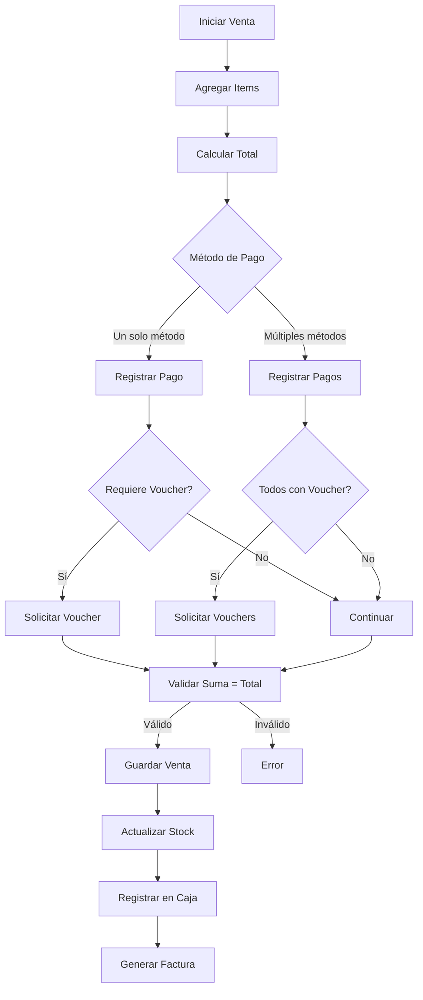

# Sistema de Pagos Múltiples - Papelería

## Descripción

Sistema que permite registrar ventas con múltiples métodos de pago (pago mixto) y requiere voucher/comprobante para transferencias y datáfono.

## Entidad: SalePayment

### Campos

| Campo | Tipo | Descripción | Requerido |
|-------|------|-------------|-----------|
| `id` | UUID | Identificador único | Sí |
| `saleId` | UUID | Venta asociada | Sí |
| `paymentMethod` | Enum | Método de pago | Sí |
| `amount` | Decimal | Monto del pago | Sí |
| `voucherNumber` | String | Número de comprobante | Condicional* |
| `referenceNumber` | String | Número de referencia | No |
| `notes` | Text | Notas adicionales | No |

**Condicional***: Requerido cuando `paymentMethod` es `transfer` o `card`

### Métodos de Pago

```typescript
enum PaymentMethod {
  CASH = 'cash',           // Efectivo - No requiere voucher
  TRANSFER = 'transfer',   // Transferencia - REQUIERE voucher
  CARD = 'card',          // Datáfono/Tarjeta - REQUIERE voucher
  NEQUI = 'nequi',        // Nequi - REQUIERE voucher
  DAVIPLATA = 'daviplata' // Daviplata - REQUIERE voucher
}
```

## Ejemplos de Uso

### Caso 1: Pago Simple (Un solo método)

**Venta de $50,000 en efectivo**

```json
{
  "total": 50000,
  "items": [...],
  "payments": [
    {
      "paymentMethod": "cash",
      "amount": 50000
    }
  ]
}
```

### Caso 2: Pago con Transferencia

**Venta de $100,000 por transferencia**

```json
{
  "total": 100000,
  "items": [...],
  "payments": [
    {
      "paymentMethod": "transfer",
      "amount": 100000,
      "voucherNumber": "TRF-20260110-001",
      "referenceNumber": "123456789"
    }
  ]
}
```

### Caso 3: Pago con Datáfono

**Venta de $75,000 con tarjeta**

```json
{
  "total": 75000,
  "items": [...],
  "payments": [
    {
      "paymentMethod": "card",
      "amount": 75000,
      "voucherNumber": "CARD-20260110-002",
      "notes": "Visa terminada en 1234"
    }
  ]
}
```

### Caso 4: Pago Mixto

**Venta de $150,000 - Mitad efectivo, mitad transferencia**

```json
{
  "total": 150000,
  "items": [...],
  "payments": [
    {
      "paymentMethod": "cash",
      "amount": 75000
    },
    {
      "paymentMethod": "transfer",
      "amount": 75000,
      "voucherNumber": "TRF-20260110-003"
    }
  ]
}
```

### Caso 5: Pago Mixto Complejo

**Venta de $200,000 - Efectivo + Tarjeta + Nequi**

```json
{
  "total": 200000,
  "items": [...],
  "payments": [
    {
      "paymentMethod": "cash",
      "amount": 50000
    },
    {
      "paymentMethod": "card",
      "amount": 100000,
      "voucherNumber": "CARD-20260110-004"
    },
    {
      "paymentMethod": "nequi",
      "amount": 50000,
      "voucherNumber": "NEQ-20260110-005"
    }
  ]
}
```

## Validaciones

### Reglas de Negocio

1. **Suma de pagos = Total de venta**
   ```typescript
   sum(payments.amount) === sale.total
   ```

2. **Voucher obligatorio para métodos electrónicos**
   ```typescript
   if (paymentMethod in ['transfer', 'card', 'nequi', 'daviplata']) {
     voucherNumber is required
   }
   ```

3. **Mínimo un método de pago**
   ```typescript
   payments.length >= 1
   ```

4. **Montos positivos**
   ```typescript
   payment.amount > 0
   ```

## Reportes

### 1. Reporte de Ventas por Método de Pago

**Endpoint**: `GET /api/reports/sales-by-payment-method`

**Query Params**:
- `date_from`: Fecha inicio
- `date_to`: Fecha fin
- `payment_method`: Filtrar por método (opcional)

**Response**:
```json
{
  "success": true,
  "data": {
    "period": {
      "from": "2026-01-01",
      "to": "2026-01-31"
    },
    "summary": {
      "total_sales": 5000000,
      "total_transactions": 150
    },
    "by_method": [
      {
        "method": "cash",
        "total_amount": 2000000,
        "transaction_count": 80,
        "percentage": 40
      },
      {
        "method": "card",
        "total_amount": 1500000,
        "transaction_count": 40,
        "percentage": 30,
        "voucher_count": 40
      },
      {
        "method": "transfer",
        "total_amount": 1000000,
        "transaction_count": 20,
        "percentage": 20,
        "voucher_count": 20
      },
      {
        "method": "nequi",
        "total_amount": 500000,
        "transaction_count": 10,
        "percentage": 10,
        "voucher_count": 10
      }
    ]
  }
}
```

### 2. Reporte de Ventas Mixtas

**Endpoint**: `GET /api/reports/mixed-payment-sales`

**Response**:
```json
{
  "success": true,
  "data": {
    "mixed_payment_sales": [
      {
        "sale_id": "uuid",
        "invoice_number": "FAC-001",
        "total": 150000,
        "date": "2026-01-10",
        "payment_count": 2,
        "payments": [
          {
            "method": "cash",
            "amount": 75000
          },
          {
            "method": "transfer",
            "amount": 75000,
            "voucher": "TRF-001"
          }
        ]
      }
    ]
  }
}
```

### 3. Reporte de Vouchers

**Endpoint**: `GET /api/reports/vouchers`

**Query Params**:
- `date_from`: Fecha inicio
- `date_to`: Fecha fin
- `payment_method`: Filtrar por método

**Response**:
```json
{
  "success": true,
  "data": {
    "vouchers": [
      {
        "voucher_number": "TRF-20260110-001",
        "payment_method": "transfer",
        "amount": 100000,
        "sale_id": "uuid",
        "invoice_number": "FAC-001",
        "date": "2026-01-10T10:30:00",
        "reference_number": "123456789"
      }
    ]
  }
}
```

### 4. Reporte de Arqueo de Caja (por método)

**Endpoint**: `GET /api/reports/cash-register-detail/:id`

**Response**:
```json
{
  "success": true,
  "data": {
    "cash_register_id": "uuid",
    "opened_at": "2026-01-10T08:00:00",
    "closed_at": "2026-01-10T18:00:00",
    "opening_amount": 50000,
    "closing_amount": 550000,
    "expected_amount": 550000,
    "difference": 0,
    "sales_count": 25,
    "payment_breakdown": [
      {
        "method": "cash",
        "count": 15,
        "total": 300000
      },
      {
        "method": "card",
        "count": 7,
        "total": 150000,
        "vouchers": ["CARD-001", "CARD-002", ...]
      },
      {
        "method": "transfer",
        "count": 3,
        "total": 100000,
        "vouchers": ["TRF-001", "TRF-002", "TRF-003"]
      }
    ]
  }
}
```

## Flujo de Venta



## Índices Recomendados

```sql
-- Sale Payments
CREATE INDEX idx_sale_payments_sale ON sale_payments(sale_id);
CREATE INDEX idx_sale_payments_method ON sale_payments(payment_method);
CREATE INDEX idx_sale_payments_voucher ON sale_payments(voucher_number);
CREATE INDEX idx_sale_payments_date ON sale_payments(created_at);
```

## Migración desde Sistema Anterior

Si ya tienes ventas con un solo `paymentMethod`, puedes migrar:

```typescript
// Migración de datos
async function migrateSinglePayments() {
  const sales = await Sale.find({ relations: ['payments'] });
  
  for (const sale of sales) {
    if (sale.payments.length === 0 && sale.paymentMethod) {
      await SalePayment.create({
        saleId: sale.id,
        paymentMethod: sale.paymentMethod,
        amount: sale.total,
      }).save();
    }
  }
}
```
