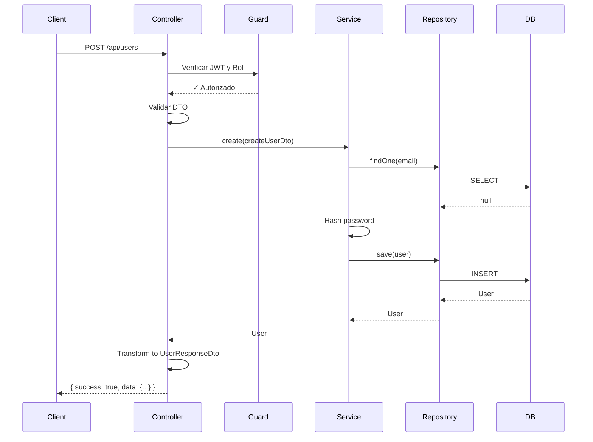

# Módulo de Usuarios - Explicación Detallada

## 📁 Estructura del Módulo

```
src/modules/users/
├── dto/
│   ├── create-user.dto.ts      # DTO para crear usuario
│   ├── update-user.dto.ts      # DTO para actualizar usuario
│   └── user-response.dto.ts    # DTO para respuestas (sin password)
├── users.controller.ts         # Controlador con endpoints
├── users.service.ts            # Lógica de negocio
└── users.module.ts             # Configuración del módulo
```

## 🎯 Patrón Utilizado

### 1. **DTOs (Data Transfer Objects)**

#### CreateUserDto
```typescript
export class CreateUserDto {
  @IsString()
  @IsNotEmpty()
  firstName: string;
  
  @IsEmail()
  email: string;
  
  @MinLength(6)
  password: string;
  
  @IsEnum(UserRole)
  role: UserRole;
}
```

**¿Qué hace?**
- ✅ **Validación automática**: `class-validator` valida cada campo
- ✅ **Documentación Swagger**: `@ApiProperty` genera docs automáticas
- ✅ **Type safety**: TypeScript garantiza tipos correctos

**Equivalente en Laravel**: `StoreUserRequest`

#### UpdateUserDto
```typescript
export class UpdateUserDto extends PartialType(CreateUserDto) {
  // Todos los campos son opcionales
}
```

**¿Qué hace?**
- ✅ `PartialType` hace todos los campos opcionales
- ✅ Reutiliza validaciones de CreateUserDto

**Equivalente en Laravel**: `UpdateUserRequest`

#### UserResponseDto
```typescript
export class UserResponseDto {
  @Expose()
  id: string;
  
  @Expose()
  email: string;
  
  @Exclude()
  password: string;  // NO se envía al cliente
}
```

**¿Qué hace?**
- ✅ **Serialización**: Controla qué campos se envían
- ✅ **Seguridad**: Excluye `password` de las respuestas
- ✅ `class-transformer` transforma automáticamente

**Equivalente en Laravel**: `UserResource`

---

### 2. **Service (Lógica de Negocio)**

```typescript
@Injectable()
export class UsersService {
  constructor(
    @InjectRepository(User)
    private usersRepository: Repository<User>,
  ) {}

  async create(createUserDto: CreateUserDto): Promise<User> {
    // 1. Verificar email único
    const existingUser = await this.usersRepository.findOne({
      where: { email: createUserDto.email },
    });
    
    if (existingUser) {
      throw new ConflictException('Email already exists');
    }

    // 2. Hash de contraseña
    const hashedPassword = await bcrypt.hash(createUserDto.password, 10);

    // 3. Crear y guardar
    const user = this.usersRepository.create({
      ...createUserDto,
      password: hashedPassword,
    });

    return await this.usersRepository.save(user);
  }
}
```

**Características**:
- ✅ **Inyección de dependencias**: `@InjectRepository`
- ✅ **TypeORM Repository**: Métodos como `findOne`, `save`, `softDelete`
- ✅ **Validaciones de negocio**: Email único, hash de password
- ✅ **Excepciones personalizadas**: `ConflictException`, `ResourceNotFoundException`

**Equivalente en Laravel**: `UserService`

---

### 3. **Controller (Endpoints)**

```typescript
@ApiTags('users')
@ApiBearerAuth()
@UseGuards(JwtAuthGuard, RolesGuard)
@Controller('users')
export class UsersController {
  constructor(private readonly usersService: UsersService) {}

  @Post()
  @Roles(UserRole.ADMIN)
  @ApiOperation({ summary: 'Create a new user' })
  async create(@Body() createUserDto: CreateUserDto) {
    const user = await this.usersService.create(createUserDto);
    return {
      data: plainToInstance(UserResponseDto, user),
      message: 'User created successfully',
    };
  }
}
```

**Decoradores explicados**:

| Decorador | Función |
|-----------|---------|
| `@ApiTags('users')` | Agrupa endpoints en Swagger |
| `@ApiBearerAuth()` | Requiere token JWT |
| `@UseGuards(JwtAuthGuard, RolesGuard)` | Protege con autenticación y roles |
| `@Controller('users')` | Ruta base: `/api/users` |
| `@Post()` | Método HTTP POST |
| `@Roles(UserRole.ADMIN)` | Solo admin puede ejecutar |
| `@ApiOperation()` | Descripción en Swagger |
| `@Body()` | Extrae body y valida con DTO |

**Equivalente en Laravel**: `UserController`

---

### 4. **Module (Configuración)**

```typescript
@Module({
  imports: [TypeOrmModule.forFeature([User])],
  controllers: [UsersController],
  providers: [UsersService],
  exports: [UsersService],  // Para usar en otros módulos
})
export class UsersModule {}
```

**¿Qué hace?**
- ✅ **Imports**: Registra entidad `User` en TypeORM
- ✅ **Controllers**: Registra el controlador
- ✅ **Providers**: Registra el servicio
- ✅ **Exports**: Permite usar `UsersService` en otros módulos (ej: AuthModule)

---

## 🔐 Seguridad Implementada

### 1. Password Hashing
```typescript
const hashedPassword = await bcrypt.hash(createUserDto.password, 10);
```
- Usa bcrypt con 10 rounds
- Nunca guarda passwords en texto plano

### 2. Password Exclusion
```typescript
@Exclude()
password: string;
```
- El password NUNCA se envía en respuestas
- `ClassSerializerInterceptor` lo excluye automáticamente

### 3. Role-Based Access
```typescript
@Roles(UserRole.ADMIN)
```
- Solo admin puede crear/editar/eliminar usuarios
- Employee puede listar y ver

### 4. Soft Delete
```typescript
await this.usersRepository.softDelete(id);
```
- No elimina físicamente
- Solo marca `deletedAt`
- Se puede recuperar

---

## 📊 Endpoints Generados

| Método | Ruta | Descripción | Rol Requerido |
|--------|------|-------------|---------------|
| POST | `/api/users` | Crear usuario | ADMIN |
| GET | `/api/users` | Listar usuarios | ADMIN, EMPLOYEE |
| GET | `/api/users/:id` | Ver usuario | ADMIN, EMPLOYEE |
| PATCH | `/api/users/:id` | Actualizar usuario | ADMIN |
| DELETE | `/api/users/:id` | Eliminar usuario | ADMIN |

---

## 🔄 Flujo de una Petición



---

## 💡 Ventajas sobre Laravel

| Característica | Laravel | NestJS |
|----------------|---------|--------|
| Validación | Manual en Request | Automática con decoradores |
| Serialización | Manual con Resource | Automática con class-transformer |
| Inyección de dependencias | Service Container | Nativo con decoradores |
| Documentación API | Manual (L5-Swagger) | Automática con Swagger |
| Type Safety | No (PHP) | Sí (TypeScript) |
| Guards/Middleware | Middleware | Guards + Interceptors |

---

## 🧪 Ejemplo de Uso

### Crear Usuario
```bash
POST /api/users
Authorization: Bearer <token>

{
  "firstName": "Juan",
  "lastName": "Pérez",
  "email": "juan@papeleria.com",
  "password": "password123",
  "role": "employee"
}
```

**Respuesta**:
```json
{
  "success": true,
  "message": "User created successfully",
  "data": {
    "id": "uuid-here",
    "firstName": "Juan",
    "lastName": "Pérez",
    "email": "juan@papeleria.com",
    "role": "employee",
    "isActive": true,
    "createdAt": "2026-01-10T10:00:00Z",
    "updatedAt": "2026-01-10T10:00:00Z"
  },
  "timestamp": "2026-01-10T10:00:00Z"
}
```

**Nota**: El `password` NO aparece en la respuesta ✅

---

## 📝 Próximos Módulos

Usando este mismo patrón, crearemos:
1. ✅ **Users** (Completado)
2. **Categories** (Siguiente)
3. **Brands**
4. **Suppliers**
5. **Products**
6. **Customers**
7. **Sales**
8. **Purchases**
9. **CashRegister**

Cada módulo seguirá la misma estructura:
- DTOs (Create, Update, Response)
- Service (Lógica de negocio)
- Controller (Endpoints)
- Module (Configuración)
